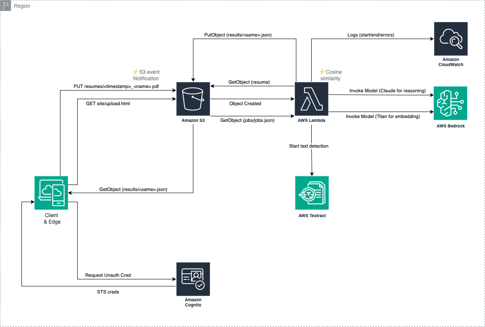

# Serverless CV Match

Upload your PDF resume → Lambda extracts text (Textract if scanned) → embeds with Amazon Bedrock → compares against jobs in S3 → Bedrock LLM explains the match → results appear in the browser.

---

## Architecture (high level)

```
Browser (upload.html)
  ├─ uses Cognito Identity Pool (unauth) → temporary AWS creds
  ├─ PUT s3://<bucket>/resumes/<timestamp>_<name>.pdf
  └─ polls s3://<bucket>/results/<same>.json

S3 (bucket)
  └─ ObjectCreated (prefix: resumes/) → triggers Lambda

Lambda (AnalyzeFn)
  ├─ s3:GetObject resume
  ├─ Textract OCR (if needed)
  ├─ Bedrock embeddings (Titan) for resume + jobs
  ├─ cosine similarity → top-K
  ├─ Bedrock LLM (Claude) for reasons/strengths/gaps/fit score
  └─ s3:PutObject results/<same>.json
```

## Architecture Diagram



**AWS Services**

* **Amazon S3** – static site, input `resumes/`, dataset `jobs/jobs.json`, output `results/`
* **AWS Lambda** – analysis pipeline (extraction → embedding → ranking → LLM summary)
* **Amazon Textract** – OCR for scanned PDFs
* **Amazon Bedrock** – Titan (embeddings) + Claude Sonnet (LLM)
* **Amazon Cognito Identity Pools** – unauth role for browser PUT/GET to S3 (scoped prefixes)

---

## Repo structure

```
resume-match/
├─ template.yaml                 # SAM/CFN: S3 bucket, S3→Lambda notification, Lambda config & IAM
├─ samconfig.toml                # stack=resume-match, region=ap-south-1, BucketName override
├─ analyze_fn/
│  ├─ app.py                     # Lambda function (hardcoded BUCKET/models; writes results/*)
│  ├─ __init__.py                # empty/marker
│  └─ requirements.txt           # empty on purpose (boto3 provided by Lambda runtime)
├─ site/
│  └─ upload.html                # Static UI (hardcoded region & bucket; Cognito ID placeholder)
├─ data/
│  └─ jobs.json                  # Demo job dataset
├─ policies/
│  ├─ cognito-unauth-s3-policy.json  # attach to unauth role; allows PUT resumes/*, GET results/* (+ multipart perms)
│  └─ s3-cors.xml                    # CORS: GET/PUT/HEAD, ETag exposed
└─ scripts/
   ├─ deploy.sh                  # SAM deploy + inject Cognito ID + upload site/data + apply CORS + enable website
   ├─ package.sh                 # sam validate + sanity checks
   └─ terminate.sh               # empty bucket + delete stack
```

---

## Prerequisites

* **AWS account** with permissions for S3, Lambda, CloudFormation/SAM, Textract, Bedrock, and Cognito
* **AWS CLI v2** and **AWS SAM CLI** installed and configured
* **Region:** `ap-south-1` (Mumbai) for *all* services in this demo
* **Bedrock model access enabled** in `ap-south-1` for:

  * `amazon.titan-embed-text-v1`
  * `anthropic.claude-3-sonnet-20240229-v1:0`
* **Cognito Identity Pool** created (enable **unauthenticated identities**)

  * Attach the policy from `policies/cognito-unauth-s3-policy.json` (update bucket name if you changed it)
  * Copy the **Identity pool ID** (`ap-south-1:xxxxxxxx-xxxx-...`)

---

## Quick start

```bash
# 0) Create Cognito Identity Pool (unauth) and attach the policy
# 1) Enable Bedrock model access (Titan embeddings + Claude Sonnet) in ap-south-1
# 2) Deploy infrastructure + site
sam build && sam deploy
bash scripts/deploy.sh
```

The script will:

* Deploy the SAM stack with bucket (`resume-match-jmanoj0905-ap-south-1`)
* Inject **IDENTITY\_POOL\_ID** into a temp HTML
* Upload `upload.html` and `data/jobs.json`
* Apply **CORS** to the bucket from `policies/s3-cors.xml`
* Enable **Static website hosting** (index = `upload.html`)

Open:

```
http://resume-match-jmanoj0905-ap-south-1.s3-website-ap-south-1.amazonaws.com
```

---

## Manual deployment (alternative)

1. **Deploy infra**

```bash
sam build
sam deploy --stack-name resume-match \
  --region ap-south-1 \
  --capabilities CAPABILITY_IAM \
  --parameter-overrides BucketName=resume-match-jmanoj0905-ap-south-1
```

2. **Upload the site & dataset**

```bash
# inject your Cognito Identity Pool ID into a temp html (keeps secrets out of Git)
sed "s|ap-south-1:REPLACE-WITH-YOUR-IDENTITY-POOL-ID|ap-south-1:YOUR-REAL-ID|" site/upload.html > /tmp/upload.html

aws s3 cp /tmp/upload.html s3://resume-match-jmanoj0905-ap-south-1/upload.html \
  --content-type text/html

aws s3 cp data/jobs.json s3://resume-match-jmanoj0905-ap-south-1/jobs/jobs.json
```

3. **Apply CORS**

```bash
aws s3api put-bucket-cors \
  --bucket resume-match-jmanoj0905-ap-south-1 \
  --cors-configuration file://policies/s3-cors.xml
```

4. **Enable website hosting**

```bash
aws s3 website s3://resume-match-jmanoj0905-ap-south-1/ --index-document upload.html
```

---

## How it works

**Front-end (`site/upload.html`)**

* Hardcoded `region` + `bucket`
* `identityPoolId` placeholder is replaced by the deploy script (from `.env`)
* Uses AWS JS SDK v2:

  * `AWS.CognitoIdentityCredentials` → temporary AWS creds
  * `s3.upload` → uploads to `resumes/<timestamp>_<filename>.pdf`
  * Polls `s3.getObject` for `results/<same>.json`; in the browser, `data.Body` is a **Blob** → parse via `await data.Body.text()` then `JSON.parse`

**Lambda (`analyze_fn/app.py`)**

* Triggered by S3 ObjectCreated on keys prefixed with `resumes/`
* Steps:

  1. Read resume; if not a PDF, decode UTF‑8; else **Textract OCR** (async → poll until `SUCCEEDED`)
  2. **Embed** resume text with **Titan Embeddings** (Bedrock)
  3. **Load** jobs from `jobs/jobs.json` (S3)
  4. For each job: embed, **cosine similarity** to resume vector
  5. Take **Top‑K** (default 5). For each, call **Claude Sonnet** (Bedrock) to produce: `reasons`, `strengths`, `gaps`, `fit_score` (JSON)
  6. Write `results/<same-name>.json` back to S3

**IAM (principle of least privilege)**

* Cognito unauth role: `s3:PutObject` (+ multipart actions) to `resumes/*`, `s3:GetObject/HeadObject` to `results/*`
* Lambda execution role: bucket‑scoped `s3:GetObject`/`PutObject`, `textract:*DocumentTextDetection`, and `bedrock:InvokeModel`
* S3 → Lambda: `AWS::Lambda::Permission` (`Principal: s3.amazonaws.com`, `SourceArn` = bucket ARN)

---

## Testing

1. Open the S3 website endpoint (or a presigned URL)
2. Choose a small PDF résumé (text PDFs return faster than scanned)
3. Click **Upload & Analyze**
4. Wait \~30–120s (Textract + embeddings + LLM). The page polls S3 and renders results

**Logs:** CloudWatch Logs → `/aws/lambda/<AnalyzeFnName>`

---

## Costs (typical)

* **S3 + Lambda:** small (storage + requests + short Lambda durations)
* **Textract:** billed per page (dominant for scanned PDFs)
* **Bedrock:** pay‑per‑request (embeddings + LLM)
* **Cognito:** free for Identity Pools

> Tip: keep PDFs short for dev. Reduce Bedrock calls by lowering Top‑K.

---

## Troubleshooting

* **403 on website**: add a bucket policy to allow public GET of `upload.html`, or use a presigned URL.
* **CORS errors**: re‑apply `policies/s3-cors.xml`; ensure region/bucket in HTML match reality.
* **Lambda not triggered**: key must start with `resumes/`; verify S3 Notification + Lambda Permission.
* **AccessDenied on Bedrock/Textract**: enable model access; check Lambda IAM.
* **Result never appears**: increase polling timeout; check CloudWatch Logs for Textract/Bedrock errors.

---

## Teardown

```bash
bash scripts/terminate.sh
```

This empties the bucket and deletes the stack. (If bucket versioning is enabled, delete object versions first.)

---

## Notes

* `analyze_fn/requirements.txt` is intentionally **empty** (Lambda includes `boto3`).
* Switch models by editing `EMBED_MODEL` / `LLM_MODEL` in `app.py` (or wire to env vars).
* To scale matching, pre‑embed jobs once and store vectors in **OpenSearch** (k‑NN) instead of re‑embedding per run.
